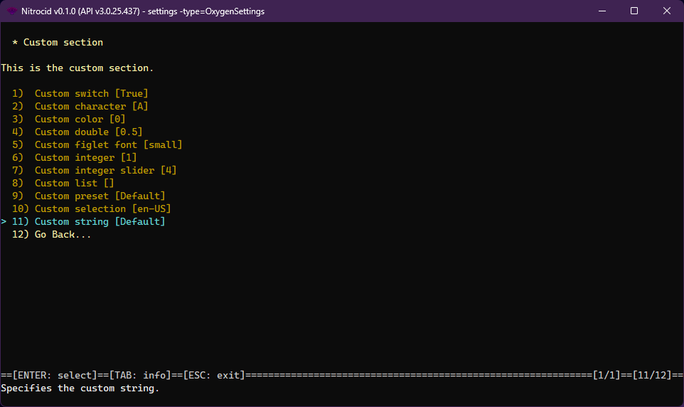

# Custom Settings

<figure><figcaption></figcaption></figure>

Customized settings give you an ability to leverage the built-in settings application provided by the Nitrocid base system to customize your mod's behavior. These settings are saved to your kernel configuration directory as JSON files under the class names for easy recognition.

***

## <mark style="color:$primary;">Defining custom settings</mark>

Before you continue, you must first understand the settings format and take a quick look at it here:


[settings-format.md](settings-format.md)


Here's how you can define the custom settings.



#### <mark style="color:$primary;">Make a custom settings class</mark>

The first thing that your custom kernel settings requires is that you need to have a class (for example, let's assume that your custom settings class name is `OxygenSettings`) that is derived from both the `BaseKernelConfig` class and the `IKernelConfig` interface.


```csharp
internal class OxygenSettings : BaseKernelConfig, IKernelConfig
{
    // Your custom settings here
}
```




#### <mark style="color:$primary;">Override the settings entries property</mark>

This class **must** override the `SettingsEntries` property from the base class so that it can understand your custom settings entries and how they're defined.

The easiest way to override it is to just let this property return an array from `SettingsEntries` using the `GetSettingsEntries` function, pointing it at your variable containing your JSON representation of the settings entries, as demonstrated in the below example:

<pre class="language-csharp" data-title="OxygenSettings.cs" data-line-numbers data-expandable="true"><code class="lang-csharp">internal class OxygenSettings : BaseKernelConfig, IKernelConfig
{
    // Your JSON representation about your settings entries
<strong>    private readonly string _entriesJson =
</strong>        """
        [
            {
                "Name": "CustomSection",
                "Desc": "This is the custom section.",
                "DisplayAs": "Custom section",
                "Keys": [
                    {
                        "Name": "Custom switch",
                        "Type": "SBoolean",
<strong>                        "Variable": "CustomSwitch",
</strong>                        "Description": "Specifies the custom switch."
                    },
                    {
                        "Name": "Custom character",
                        "Type": "SChar",
<strong>                        "Variable": "CustomChar",
</strong>                        "Description": "Specifies the custom character."
                    },
                    {
                        "Name": "Custom color",
                        "Type": "SColor",
<strong>                        "Variable": "CustomColor",
</strong>                        "Description": "Specifies the custom color."
                    },
                    {
                        "Name": "Custom double",
                        "Type": "SDouble",
<strong>                        "Variable": "CustomDouble",
</strong>                        "Description": "Specifies the custom double."
                    },
                    {
                        "Name": "Custom figlet font",
                        "Type": "SFiglet",
<strong>                        "Variable": "CustomFigletFont",
</strong>                        "Description": "Specifies the custom figlet font."
                    },
                    {
                        "Name": "Custom integer",
                        "Type": "SInt",
<strong>                        "Variable": "CustomInt",
</strong>                        "Description": "Specifies the custom integer."
                    },
                    {
                        "Name": "Custom integer slider",
                        "Type": "SIntSlider",
<strong>                        "Variable": "CustomIntSlider",
</strong>                        "Description": "Specifies the custom integer slider.",
                        "MinimumValue": 0,
                        "MaximumValue": 255
                    },
                    {
                        "Name": "Custom list",
                        "Type": "SList",
<strong>                        "Variable": "CustomList",
</strong>                        "SelectionFunctionName": "GetPathList",
                        "SelectionFunctionType": "Filesystem",
                        "DelimiterVariable": "PathLookupDelimiter",
                        "IsValuePath": true,
                        "IsPathCurrentPath": true,
                        "Description": "Specifies the custom list."
                    },
                    {
                        "Name": "Custom preset",
                        "Type": "SPreset",
<strong>                        "Variable": "CustomPreset",
</strong>                        "ShellType": "Shell",
                        "Description": "Specifies the custom preset."
                    },
                    {
                        "Name": "Custom selection",
                        "Type": "SSelection",
<strong>                        "Variable": "CustomSelection",
</strong>                        "IsEnumeration": false,
                        "SelectionFunctionName": "ListAllLanguages",
                        "SelectionFunctionType": "LanguageManager",
                        "IsSelectionFunctionDict": true,
                        "SelectionFallback": [ "en-US" ],
                        "Description": "Specifies the custom selection."
                    },
                    {
                        "Name": "Custom string",
                        "Type": "SString",
<strong>                        "Variable": "CustomString",
</strong>                        "Description": "Specifies the custom string."
                    }
                ]
            }
        ]
        """;

    // You must override this
<strong>    public override SettingsEntry[] SettingsEntries =>
</strong><strong>        ConfigTools.GetSettingsEntries(_entriesJson);
</strong>
    // Your variables. Your JSON representation of the entries must contain information about these
<strong>    public char CustomChar { get; set; } = 'A';
</strong><strong>    public string CustomColor { get; set; } = Color.Empty.PlainSequence;
</strong><strong>    public double CustomDouble { get; set; } = 0.5d;
</strong><strong>    public bool CustomSwitch { get; set; } = true;
</strong><strong>    public string CustomFigletFont { get; set; } = "small";
</strong><strong>    public int CustomInt { get; set; } = 1;
</strong><strong>    public int CustomIntSlider { get; set; } = 4;
</strong><strong>    public string CustomList { get; set; } = "";
</strong><strong>    public string CustomPreset { get; set; } = "Default";
</strong><strong>    public string CustomString { get; set; } = "Default";
</strong><strong>    public string CustomSelection { get; set; } = "en-US";
</strong>}
</code></pre>


Beware that your base kernel configuration class must contain valid entries in your list of entries under the JSON representation.

You can use the below function to convert your JSON settings entries to their usable ones:

```csharp
public static SettingsEntry[] GetSettingsEntries(string entriesText) { }
```

You can also embed your settings JSON content if it became too big using the Resources feature, which you can learn more about how to add a file to your project resources and use it [here](https://learn.microsoft.com/en-us/dotnet/core/extensions/create-resource-files).

You don't have to save a copy of your `customSettings` variable, since it gets added to the custom settings list that the kernel configuration tool supervises.




#### <mark style="color:$primary;">Register your configuration class</mark>

After that, you must register your configuration class by just two lines somewhere in your mod initialization code:


```csharp
var customSettings = new OxygenSettings();
ConfigTools.RegisterCustomSetting(customSettings);
```





Once your mod registers a settings instance, it can never be unloaded due to a current limitation affecting serialization and deserialization of JSON files.


***

## <mark style="color:$primary;">Additional tools</mark>

After you register your own custom settings, you can now use the following tools:

<details>

<summary>Using your own custom settings</summary>

To use your own custom settings, you'll have to get a settings instance from `GetKernelConfig()` before being able to get the updated settings instance containing your configured settings, even if you have a new instance of your custom settings.

You can easily wrap it to a property like this:


```csharp
internal static BaseKernelConfig Configuration =>
    Config.GetKernelConfig(nameof(OxygenSettings));
```


You can then get a value from your desired settings key.

For example, if you want to get a value of a string configuration defined earlier, called `CustomString`, you can get the value of this key like this:


```csharp
var key = ConfigTools.GetSettingsKey(Configuration, nameof(OxygenSettings.CustomString));
string value = (string)ConfigTools.GetValueFromEntry(key, Configuration);
```



If you used this method against your newly-created instance of your custom settings (the `customSettings` variable) instead of the above property, calls to `GetValueFromEntry()` would not return the configured results changed by the settings command.


</details>

<details>

<summary>Testing your own custom settings</summary>

To test your own custom settings to check to see if it works or not, make sure that you've registered your custom settings upon starting your mod. Invoking the help usage of the `settings` command (`help settings`) is enough to list all of your kernel settings (built-in and custom).

Use the `settings` command to specify your kernel settings type with the `-type` switch, pointing it to your custom kernel settings name, which is usually your settings class name, for example, `settings -type=OxygenSettings`.

If everything goes well, you should be able to change your settings there.


When registering custom settings, the kernel runs a validation test to ensure that your custom settings are formed well before adding it to the list. If it fails, the kernel will give you a list of the configuration entries that you'll have to fix before being able to use them.



If **any** of the kernel configuration entries is invalid, the configuration tools will report a failure. Make sure that all of the entries are valid and that you've specified the variable names correctly. Use `nameof` to help you assign them.

**The variable names are case-sensitive.**


</details>

<details>

<summary>Fallback configuration</summary>

You can generate a configuration instance that contains all fallback values that are determined by the constructor of all settings properties. You can provide either a configuration class as a generic type argument, or a config type name, using the `GetFallbackKernelConfig()` function.

To demonstrate that, you can use either of the following:

* <kbd>F8</kbd>: Reset all configuration entries
* <kbd>SHIFT</kbd> + <kbd>R</kbd>: Reset selected configuration entry


Some of the kernel settings may store the current settings, even if the fallback instances are generated. Settings for your mods should not rely on external variables when possible.


</details>

<details>

<summary>Unregistering your own custom settings</summary>

You can unregister your custom settings by putting the `UnregisterCustomSetting()` function somewhere in your mod stop function like this:


```csharp
ConfigTools.UnregisterCustomSetting(nameof(OxygenSettings));
```



You don't have to do all the guesswork to figure out how to get your custom configuration name. All you have to do is to point the above function to the name of your configuration class using the `nameof` function.


</details>
