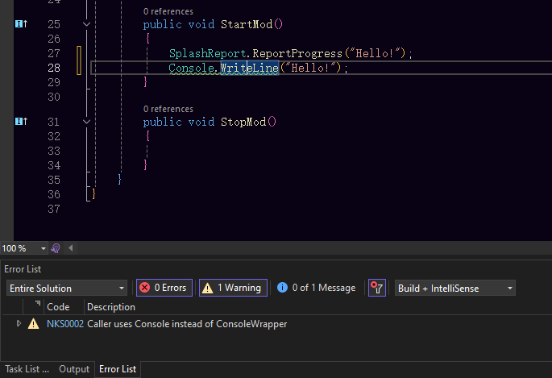
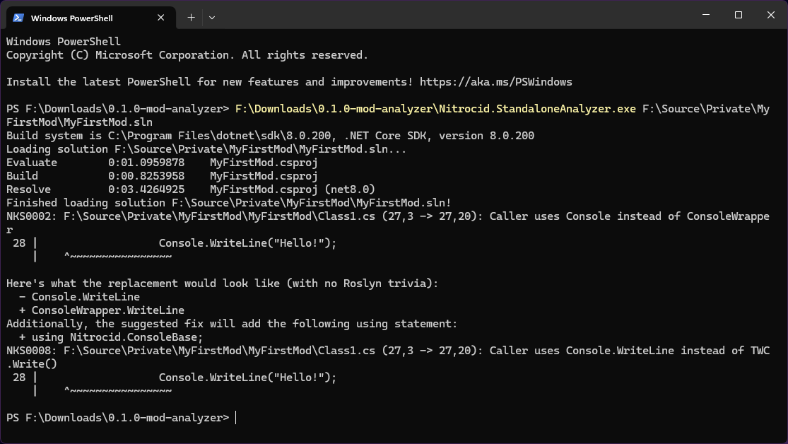

# Analyzing your Mod

Analyzers, in .NET, are tools that allow you to check the quality of your code and to fix common design pitfalls in your code. These fixes typically tailor the use of better features or the removal of unnecessary code.

Similarly, we provide you with analyzers that detect the usage of non-Nitrocid methods and classes and provide you fixes that make use of Nitrocid methods and classes as good alternatives. These analyzers are applicable only to Nitrocid mods.

We provide you two types of analyzers for your Nitrocid mods:

* **NuGet-based analyzers**: They analyze your mods while you're working on them in .NET IDEs.
* **Standalone analyzers**: They analyze your mod code outside Visual Studio.

In this page, we'll give you instructions on how to install such analyzers. Choose the analyzer type based on your preferences.

***

## <mark style="color:$primary;">Installation</mark>

There are two types of Nitrocid analyzers as highlighted above. This section shows you how to analyze your code with either the NuGet analyzer package or the standalone analyzer. The mod analyzer package found in the release contains both the standalone analyzer and the NuGet-based analyzer.

Visual Studio

In order to install the NuGet-based analyzer for Nitrocid mods on Visual Studio, follow the below steps:

1. Open Visual Studio 2026 to a solution of your choice and open `Manage NuGet packages` on a project you want to analyze.
2. Search for `Nitrocid.Analyzers`
3. Install the package
4.  Start working on your mod, and you'll see `NKS` analyzers. 

    <figure><figcaption></figcaption></figure>

Standalone Analyzer

In case you can't use NuGet-based analyzer for your mods, you can use the standalone analyzer. To use it, follow the steps:

1. Open the command prompt
2. Go to the directory where the standalone analyzer is located. Use `cd` to change the directory.
3.  Run `dotnet Nitrocid.StandaloneAnalyzer.dll path/to/mod.sln` 

    <figure><figcaption></figcaption></figure>

***

## <mark style="color:$primary;">Suppression</mark>

You can suppress this warning by including it in the appropriate place, whichever is convenient.

For more information about how to suppress any warning issued by the Nitrocid analyzer, visit the below page:




We recommend that you avoid suppressing any of Nitrocid's analysis methods, unless you're sure that your mod behaves correctly.


***

## <mark style="color:$primary;">Diagnostics</mark>

The following code analyzers are shipped, with links to each page:



The following analyzers generate warnings:

<table><thead><tr><th width="140">Diag. ID</th><th data-type="content-ref">Page</th></tr></thead><tbody><tr><td><code>NKS0001</code></td><td><a href="text-nks0001.md">text-nks0001.md</a></td></tr><tr><td><code>NKS0002</code></td><td><a href="consolebase-nks0002.md">consolebase-nks0002.md</a></td></tr><tr><td><code>NKS0003</code></td><td><a href="consolebase-nks0003.md">consolebase-nks0003.md</a></td></tr></tbody></table>



The following analyzers generate suggestions that are shown under the Messages section of the Errors List on your Visual Studio:

<table><thead><tr><th width="140">Diag. ID</th><th data-type="content-ref">Page</th></tr></thead><tbody><tr><td><code>NKS0004</code></td><td><a href="consolebase-nks0004.md">consolebase-nks0004.md</a></td></tr><tr><td><code>NKS0005</code></td><td><a href="consolebase-nks0005.md">consolebase-nks0005.md</a></td></tr><tr><td><code>NKS0006</code></td><td><a href="consolebase-nks0006.md">consolebase-nks0006.md</a></td></tr><tr><td><code>NKS0007</code></td><td><a href="consolebase-nks0007.md">consolebase-nks0007.md</a></td></tr><tr><td><code>NKS0008</code></td><td><a href="consolebase-nks0008.md">consolebase-nks0008.md</a></td></tr><tr><td><code>NKS0009</code></td><td><a href="consolebase-nks0009.md">consolebase-nks0009.md</a></td></tr><tr><td><code>NKS0010</code></td><td><a href="files-nks0010.md">files-nks0010.md</a></td></tr><tr><td><code>NKS0011</code></td><td><a href="files-nks0011.md">files-nks0011.md</a></td></tr><tr><td><code>NKS0012</code></td><td><a href="files-nks0012.md">files-nks0012.md</a></td></tr><tr><td><code>NKS0013</code></td><td><a href="files-nks0013.md">files-nks0013.md</a></td></tr><tr><td><code>NKS0014</code></td><td><a href="files-nks0014.md">files-nks0014.md</a></td></tr><tr><td><code>NKS0015</code></td><td><a href="files-nks0015.md">files-nks0015.md</a></td></tr><tr><td><code>NKS0016</code></td><td><a href="files-nks0016.md">files-nks0016.md</a></td></tr><tr><td><code>NKS0017</code></td><td><a href="files-nks0017.md">files-nks0017.md</a></td></tr><tr><td><code>NKS0018</code></td><td><a href="files-nks0018.md">files-nks0018.md</a></td></tr><tr><td><code>NKS0019</code></td><td><a href="files-nks0019.md">files-nks0019.md</a></td></tr><tr><td><code>NKS0020</code></td><td><a href="files-nks0020.md">files-nks0020.md</a></td></tr><tr><td><code>NKS0021</code></td><td><a href="files-nks0021.md">files-nks0021.md</a></td></tr><tr><td><code>NKS0022</code></td><td><a href="files-nks0022.md">files-nks0022.md</a></td></tr><tr><td><code>NKS0023</code></td><td><a href="files-nks0023.md">files-nks0023.md</a></td></tr><tr><td><code>NKS0024</code></td><td><a href="kernel-nks0024.md">kernel-nks0024.md</a></td></tr><tr><td><code>NKS0025</code></td><td><a href="kernel-nks0025.md">kernel-nks0025.md</a></td></tr><tr><td><code>NKS0026</code></td><td><a href="kernel-nks0026.md">kernel-nks0026.md</a></td></tr><tr><td><code>NKS0027</code></td><td><a href="kernel-nks0027.md">kernel-nks0027.md</a></td></tr><tr><td><code>NKS0031</code></td><td><a href="kernel-nks0031.md">kernel-nks0031.md</a></td></tr><tr><td><code>NKS0032</code></td><td><a href="kernel-nks0032.md">kernel-nks0032.md</a></td></tr><tr><td><code>NKS0033</code></td><td><a href="kernel-nks0033.md">kernel-nks0033.md</a></td></tr><tr><td><code>NKS0037</code></td><td><a href="kernel-nks0037.md">kernel-nks0037.md</a></td></tr><tr><td><code>NKS0038</code></td><td><a href="kernel-nks0038.md">kernel-nks0038.md</a></td></tr><tr><td><code>NKS0039</code></td><td><a href="kernel-nks0039.md">kernel-nks0039.md</a></td></tr><tr><td><code>NKS0040</code></td><td><a href="kernel-nks0040.md">kernel-nks0040.md</a></td></tr><tr><td><code>NKS0041</code></td><td><a href="kernel-nks0041.md">kernel-nks0041.md</a></td></tr><tr><td><code>NKS0042</code></td><td><a href="kernel-nks0042.md">kernel-nks0042.md</a></td></tr><tr><td><code>NKS0043</code></td><td><a href="kernel-nks0043.md">kernel-nks0043.md</a></td></tr><tr><td><code>NKS0052</code></td><td><a href="kernel-nks0052.md">kernel-nks0052.md</a></td></tr><tr><td><code>NKS0053</code></td><td><a href="kernel-nks0053.md">kernel-nks0053.md</a></td></tr><tr><td><code>NKS0044</code></td><td><a href="languages-nks0044.md">languages-nks0044.md</a></td></tr><tr><td><code>NKS0045</code></td><td><a href="languages-nks0045.md">languages-nks0045.md</a></td></tr><tr><td><code>NKS0046</code></td><td><a href="languages-nks0046.md">languages-nks0046.md</a></td></tr><tr><td><code>NKS0051</code></td><td><a href="network-nks0051.md">network-nks0051.md</a></td></tr><tr><td><code>NKS0047</code></td><td><a href="text-nks0047.md">text-nks0047.md</a></td></tr><tr><td><code>NKS0048</code></td><td><a href="text-nks0048.md">text-nks0048.md</a></td></tr><tr><td><code>NKS0049</code></td><td><a href="text-nks0049.md">text-nks0049.md</a></td></tr><tr><td><code>NKS0050</code></td><td><a href="text-nks0050.md">text-nks0050.md</a></td></tr><tr><td><code>NKS0054</code></td><td><a href="text-nks0054.md">text-nks0054.md</a></td></tr><tr><td><code>NKS0055</code></td><td><a href="text-nks0055.md">text-nks0055.md</a></td></tr></tbody></table>




It's vital to follow the analyzer recommendations to get the best mod code according to the standards.

