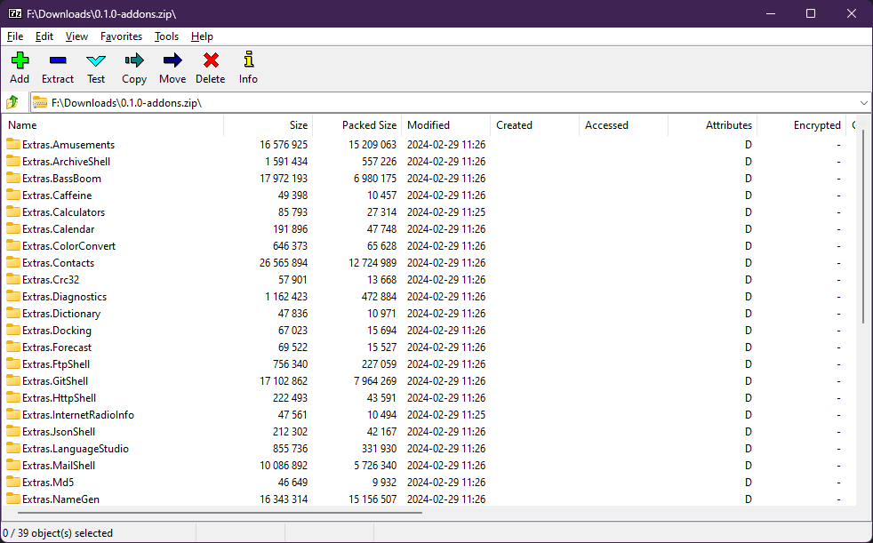
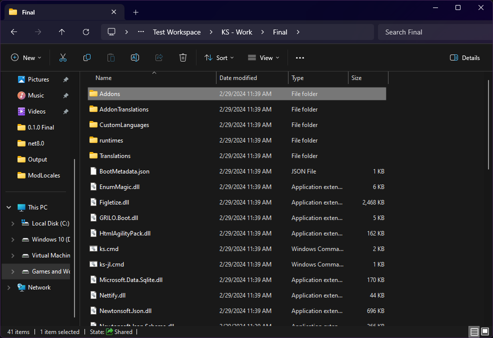
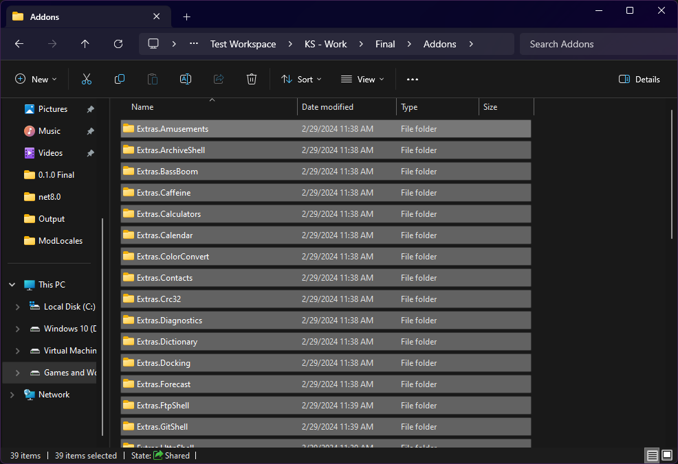

# Extra Features

In addition to the base kernel features that are highlighted in the list of simulated kernel features after this master page, the kernel also provides extra features if their associated addons are installed to the kernel.

Select a page below to go to a feature:


[more-networking](more-networking/)



[games-and-amusements](games-and-amusements/)



[common-programs](common-programs/)



[more-editors](more-editors/)



[docking.md](docking.md)



[Broken link](/broken/pages/m0taKYKID84nMLd7VZgW)



[theme-studio.md](theme-studio.md)


## How do I get them?

You can get these extra features, including extra languages, splashes, and screensavers, by either downloading the addons ZIP file from the releases page of the Nitrocid project at GitHub, or by using the `getaddons` command.


When downloading addons, consider the following points:

* It's necessary to reboot the kernel for the addons to get loaded.
* The addon pack size is around **100+ MB**, so you need to download it on unmetered networks, such as WiFi. This is to reduce your data fee.


### Installing addons manually

In case the `getaddons` command didn't work properly, you'll have to resort to installing the kernel addons manually. We have packed the addons pack for each release for easy installation. To install the addons manually, follow these steps:

1.  Download an `-addons.zip` file that corresponds to your kernel version from [this page](https://github.com/Aptivi/NitrocidKS/releases) and open your favorite archive manager. 

    <figure><figcaption></figcaption></figure>
2.  Make a new folder under the Nitrocid KS binary folder called `Addons`. 

    <figure><figcaption></figcaption></figure>
3.  Extract all the folders to the `Addons` folder. 

    <figure><figcaption></figcaption></figure>
4. Run Nitrocid KS and verify that the addon commands work.

## What are addons?

Addons are program extension libraries that extend the functionality of a program. It allows more flexibility because they either provide extra features, change how a specific program function works, or change how they look and feel.

In addition, Nitrocid KS provides an addon system that loads all the kernel addons that are built with the Nitrocid project. Mods are the second kind of kernel addons that have lesser privileges, but can be made easily by you. The documentation provides you instructions on how to make your own mod (not zero-code!) using the page below:


[your-mod.md](../../../advanced-and-power-users/kernel-modifications/your-mod.md)

