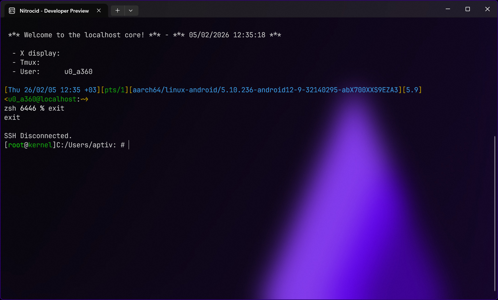

# Simon

<figure><figcaption></figcaption></figure>

Inspired by the Simon colors game that is actually a memory game, Nitrocid now has a dedicated game for simulating this game. Simon is a game that chooses random sets of four colors for you to memorize and repeat. If you got one color wrong, the game is over.

### Controls

* `1` to select green
* `2` to select red
* `3` to select blue
* `4` to select yellow
* `ESC` to exit
