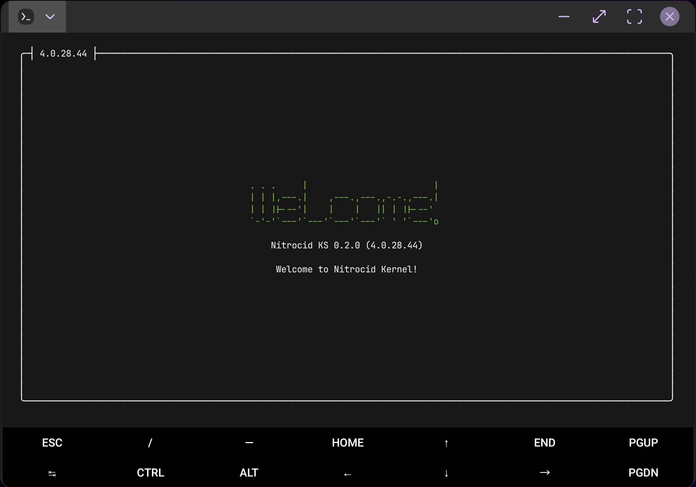

# Android

<figure><figcaption></figcaption></figure>

The tricky part is getting Nitrocid KS to run on Android phones and tablets, especially those that run the latest version of Android.

***

## <mark style="color:$primary;">Installation</mark>

To install Nitrocid KS on your phone or tablet, install the following dependencies:

* [Termux](https://termux.dev/en/)
* [Ubuntu PRoot](https://wiki.termux.com/wiki/PRoot#Installing_Linux_distributions)
* PulseAudio on your Termux environment

Ensure that your Android version is compatible with Termux. You need at least 8 GB of free storage and Android 7.0 or higher.


To get a better experience with Nitrocid KS on your phone or your tablet, it's advisable to get a phone or a tablet that supports desktop mode ([Samsung DeX](https://insights.samsung.com/2022/08/12/the-beginners-guide-to-samsung-dex-11/) for example) and a Bluetooth mouse and keyboard.


Once you're done, follow the steps:



#### <mark style="color:$primary;">Set up environment</mark>

You'll need to set up the environment.

1. Install Termux
2. Install `proot-distro` using the following command:
   * `pkg install proot-distro`
3. Install the Ubuntu proot
   * `proot-distro install ubuntu`



#### <mark style="color:$primary;">Set up PulseAudio</mark>

You'll need to set up PulseAudio.

1. In the Termux environment (not proot), install PulseAudio
   * `pkg install pulseaudio`
2. Append the following text at the end of the `$PREFIX/etc/pulse/default.pa` like this:
   1. `echo "load-module module-simple-protocol-tcp source=OpenSL_ES_sink.monitor port=12345 record=true" >> $PREFIX/etc/pulse/default.pa`
3. Start PulseAudio. Note that you'll have to repeat this each time you exit and re-open Termux.
   1. `pulseaudio --start --load="module-native-protocol-tcp auth-ip-acl=127.0.0.1 auth-anonymous=1" --exit-idle-time=-1`



#### <mark style="color:$primary;">Configure the Ubuntu package manager</mark>

In the proot environment, you'll need to configure the Ubuntu package manager to be able to install packages.

1. Log in to the Ubuntu proot
   * `proot-distro login ubuntu`
2. Ensure that you've updated the package cache
   * `apt update`
   * `apt dist-upgrade`



#### <mark style="color:$primary;">Install .NET 10.0, wget, and unzip</mark>

You won't be able to run BassBoom if you haven't installed .NET 10.0.

1. Install the .NET 10.0 runtime
   * `apt install dotnet-runtime-10.0`
2. Install `wget` and `unzip`
   * `apt install wget unzip`



#### <mark style="color:$primary;">Download the ZIP archive</mark>

Follow this step to download the ZIP archive.

1. Download the latest release from [this page](https://github.com/Aptivi/Nitrocid/releases).
   * `wget https://github.com/Aptivi/Nitrocid/releases/download/v0.x.x.x/0.x.x.x-bin.zip`



#### <mark style="color:$primary;">Extract the ZIP archive</mark>

Follow this step to extract the ZIP archive.

1. Use `unzip` to extract the files
   * `unzip 0.x.x.x-bin.zip`



#### <mark style="color:$primary;">Execute Nitrocid</mark>

Follow this step to execute Nitrocid.

1. Execute `dotnet Nitrocid.dll`




If you get no audio input and you're using a Samsung device with **One UI 6.1** or higher, kill PulseAudio with `pkill pulseaudio`, then append `LD_PRELOAD=/system/lib64/libskcodec.so` before the above command like this:

1. `LD_PRELOAD=/system/lib64/libskcodec.so pulseaudio --start --load="module-native-protocol-tcp auth-ip-acl=127.0.0.1 auth-anonymous=1" --exit-idle-time=-1`


***

## <mark style="color:$primary;">Upgrade</mark>

The only way to upgrade Nitrocid in Android is to unpack the updated files manually. This assumes that you've already set up PulseAudio, that it's working on your Android device, and that `wget` and `unzip` is installed.

To upgrade, follow these steps:



#### <mark style="color:$primary;">Log in to the Ubuntu proot environment</mark>

In the proot environment, you'll need to login to it.

1. Log in to the Ubuntu proot
   * `proot-distro login ubuntu`



#### <mark style="color:$primary;">Download the ZIP archive</mark>

Follow this step to download the ZIP archive.

1. Download the latest release from [this page](https://github.com/Aptivi/Nitrocid/releases).
   * `wget https://github.com/Aptivi/Nitrocid/releases/download/v0.x.x.x/0.x.x.x-bin.zip`



#### <mark style="color:$primary;">Extract the ZIP archive</mark>

Follow this step to extract the ZIP archive.

1. Use `unzip` to extract the files
   * `unzip 0.x.x.x-bin.zip`



#### <mark style="color:$primary;">Execute Nitrocid</mark>

Follow this step to execute Nitrocid.

1. Execute `dotnet Nitrocid.dll`


