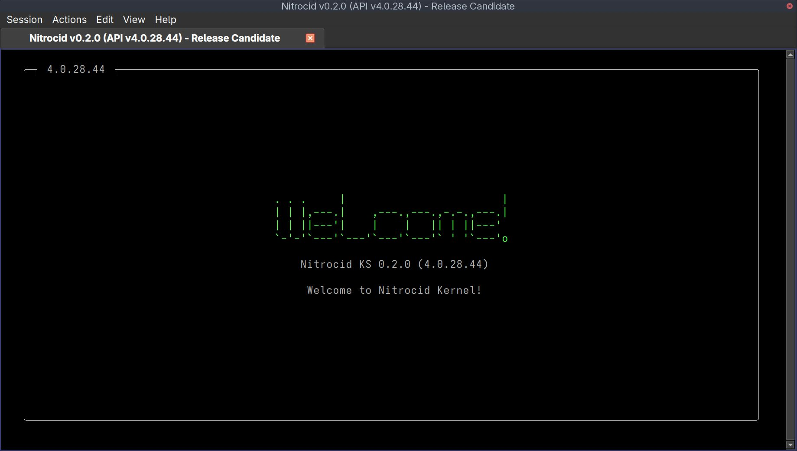

# Linux

<figure><figcaption></figcaption></figure>


<mark style="color:blue;">**We now officially support**</mark> [<mark style="color:blue;">**Arch Linux**</mark>](https://archlinux.org/) <mark style="color:blue;">**as the distro for 64-bit (AMD + Intel and ARM) processors!**</mark>


Installing Nitrocid KS on Linux is straightforward, but we recommend installing the simulator using the manual unpack method.

Before performing the installation, your Linux system must meet the following requirements:


Extra kernel add-ons may require additional hardware on your computer to work. For example, the BassBoom addon requires that you have audio drivers installed on your computer.


To run Nitrocid KS in the absolute minimum requirements, your computer needs to have the following installed:

| System            | Framework                                                            | Terminal                      |
| ----------------- | -------------------------------------------------------------------- | ----------------------------- |
| Supported distros | [.NET 10.0](https://dotnet.microsoft.com/en-us/download/dotnet/10.0) | Konsole, GNOME Terminal, etc. |

You can consult the required dependencies here:

<details>

<summary>Dependency information</summary>

In order to run Nitrocid KS on your Linux system, you must install the essential requirements as shown in the platform-specific installation pages. However, for Linux and Android systems, you must also install the following dependencies to be able to use Nitrocid.


For [Ubuntu](https://packages.ubuntu.com/search?keywords=icu\&searchon=sourcenames), [Debian](https://packages.debian.org/search?suite=all\&searchon=sourcenames\&keywords=icu), and their alternatives, you can consult a list of `libicu` versions that you can download for your distribution version. Replace `libicuXX` with the library version number applicable for your distribution.


* For Debian and its derivatives (Ubuntu, LMDE, ...)
  * ```sh
    sudo apt install tzdata
    ```
* For Android (Ubuntu PRoot on Termux)
  * ```sh
    sudo apt install libicuXX tzdata
    ```
* For Red Hat Enterprise Linux, Rocky Linux, AlmaLinux, ...
  * ```sh
    sudo dnf install -y epel-release
    sudo dnf install -y libicu tzdata
    ```
* For OpenSUSE
  * ```sh
    sudo zypper install libicu tzdata
    ```
* For Arch Linux and its derivatives (EndeavorOS, ...)
  * ```sh
    sudo pacman -S icu tzdata
    ```
* For Alpine Linux
  * ```sh
    sudo apk add icu icu-libs icu-data-full tzdata
    ```


Depending on a distribution and the amount of packages installed in the current system, the download size will be from 30 to 100 MB.

For addons, extra dependencies might be needed to work. For example, the BassBoom addon might need PulseAudio or ALSA working.


Dependency information for each package installed in your target system:

* `icu` and its related packages
  * To provide localization information. Needed for the multilingual kernel system.
* `tzdata`
  * To provide time zone information, like listing all available time zones.

In addition to the base kernel requirements, all addons might require additional packages to be installed in your system:

* `pulseaudio, libasound2, ...`
  * To be able to play music using PulseAudio, ALSA, JACK, etc. Used by the BassBoom addon.

</details>

***

## <mark style="color:$primary;">Installation</mark>

There are several ways to install Nitrocid KS on Linux systems.

<details>

<summary>Method 1: Manually unpacking</summary>

If you like to manually unpack the Nitrocid KS packages, follow these steps:

1. Ensure that you have all the required software installed
2. Download the latest release ZIP file from [this page](https://github.com/Aptivi/Kernel-Simulator/releases)
3. Unpack the ZIP archive to any folder of your choice
4. Open your favorite terminal emulator, like Konsole, and change the working directory to a folder containing the Nitrocid KS executable
5. Execute `dotnet Nitrocid.dll` to start the kernel

</details>

<details>

<summary>Method 2: Ubuntu PPA</summary>

If you're running Ubuntu, you can install Nitrocid KS using the Ubuntu PPA. Just follow these steps:

1. Open your terminal emulator and execute the following:
   * `sudo add-apt-repository ppa:eofla/nitrocid`
   * `sudo apt update`
2. Install the `nitrocid` package and follow the instructions (appending the `-XX` suffix to indicate the third mod API version part, such as `28`)
   * `sudo apt install nitrocid-28`
3. Start `ks` (appending the same suffix above, like `ks-28`), or use your app drawer to find `Nitrocid KS` corresponding to your installed mod API version


You can choose between the version series that you want to upgrade in the output of the `apt` command when it prompts you to select one of them, as `nitrocid` is a virtual package.



This only applies to Ubuntu and its derivatives. However, we only support the vanilla Ubuntu distribution. <mark style="color:red;">**Don't try this method on**</mark> [<mark style="color:red;">**Debian**</mark>](https://wiki.debian.org/DontBreakDebian#Don.27t_make_a_FrankenDebian)<mark style="color:red;">**.**</mark>


</details>

<details>

<summary>Method 3: Arch Linux AUR</summary>

If you're running Arch, you can install Nitrocid KS using the Arch Linux AUR. Just follow these steps:

1. Open your terminal emulator and install your preferred AUR helper. Further steps assume that you have [Yay](https://github.com/Jguer/yay) installed.
2. Install the `nitrocid-28` package and follow the instructions (appending the `-XX` suffix to indicate the third mod API version part, such as `28`)
   * `yay -Sy nitrocid-28`
3. Start `ks` (appending the same suffix above, like `ks-28`), or use your app drawer to find `Nitrocid KS` corresponding to your installed mod API version


This only applies to vanilla Arch Linux. We don't officially support Arch's derivatives, such as Manjaro and EndeavourOS.



You can't install the release version and the cutting-edge (those with the `-git` suffix) version at the same time, since files conflict.


</details>

***

## <mark style="color:$primary;">Upgrade</mark>

Upgrading Nitrocid on Linux is simple, depending on the way you've installed it. To upgrade it, choose your preferred method.

<details>

<summary>Method 1: Manually unpacking</summary>

If you'd like to manually update your kernel to the latest version or to the latest bleeding-edge version, follow these steps:

1. Ensure that you have all the required software installed
2. Download the latest release ZIP file from [this page](https://github.com/Aptivi/Kernel-Simulator/releases)
3. Unpack the ZIP archive to any folder of your choice
4. Open your favorite terminal emulator, like Konsole, and change the working directory to a folder containing the Nitrocid KS executable
5. Execute `dotnet Nitrocid.dll` to start the kernel

</details>

<details>

<summary>Method 2: Ubuntu PPA</summary>

If you're running Ubuntu, you can update Nitrocid KS using the Ubuntu PPA, assuming that you have the same series installed. Just follow these steps:

1. Open your terminal emulator and execute the following:
   * `sudo apt update`
2. Install the `nitrocid` package and follow the instructions (appending the `-XX` suffix to indicate the third mod API version part, such as `28`)
   * `sudo apt install nitrocid-28`
3. Start `ks` (appending the same suffix above, like `ks-28`), or use your app drawer to find `Nitrocid KS` corresponding to your installed mod API version


You can choose between the version series that you want to upgrade in the output of the `apt` command when it prompts you to select one of them, as `nitrocid` is a virtual package.



This only applies to Ubuntu and its derivatives. However, we only support the vanilla Ubuntu distribution. <mark style="color:red;">**Don't try this method on**</mark> [<mark style="color:red;">**Debian**</mark>](https://wiki.debian.org/DontBreakDebian#Don.27t_make_a_FrankenDebian)<mark style="color:red;">**.**</mark>


</details>

<details>

<summary>Method 3: Arch Linux AUR</summary>

If you're running Arch, you can install Nitrocid KS using the Arch Linux AUR. Just follow these steps:

1. Open your terminal emulator and install your preferred AUR helper. Further steps assume that you have [Yay](https://github.com/Jguer/yay) installed.
2. Install the `nitrocid` package and follow the instructions (appending the `-XX` suffix to indicate the third mod API version part, such as `28`)
   * `yay -Sy nitrocid-28`
3. Start `ks` (appending the same suffix above, like `ks-28`), or use your app drawer to find `Nitrocid KS` corresponding to your installed mod API version


You can't install the release version and the cutting-edge (those with the `-git` suffix) version at the same time, since files conflict.



This only applies to vanilla Arch Linux. We don't officially support Arch's derivatives, such as Manjaro and EndeavourOS.


</details>
